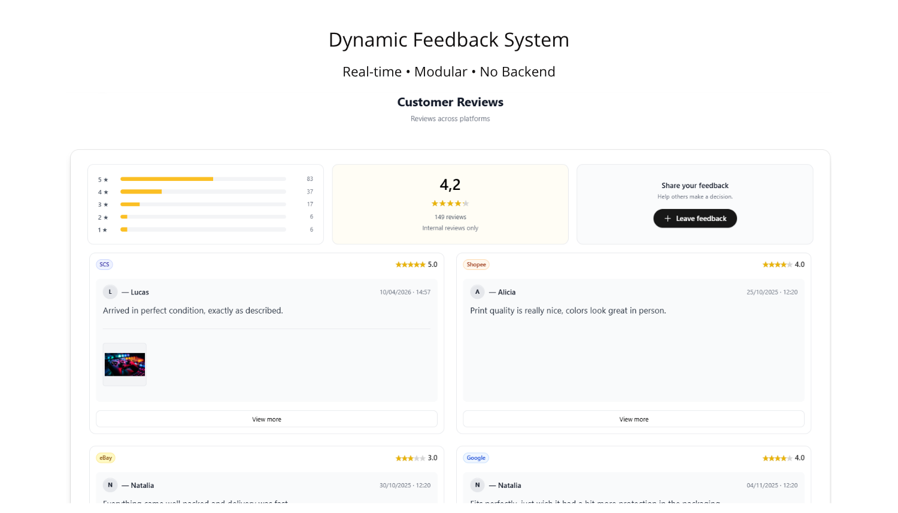
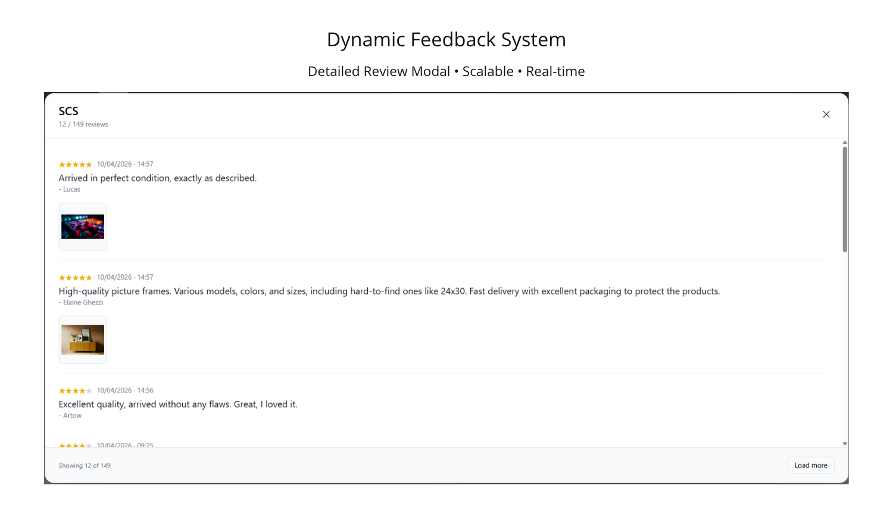
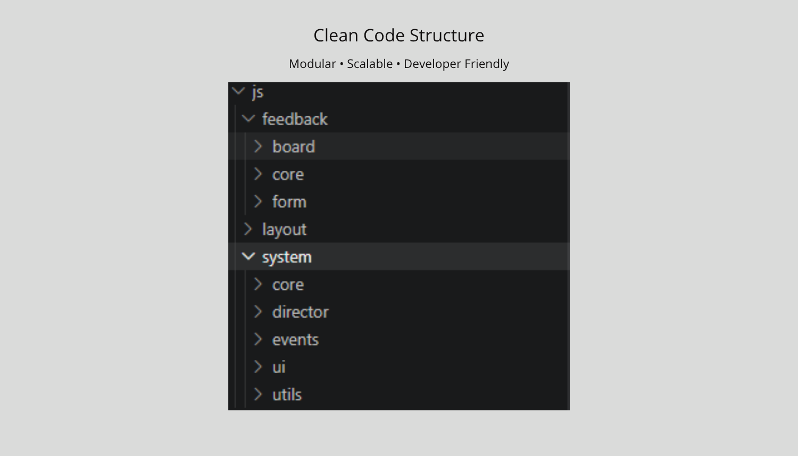
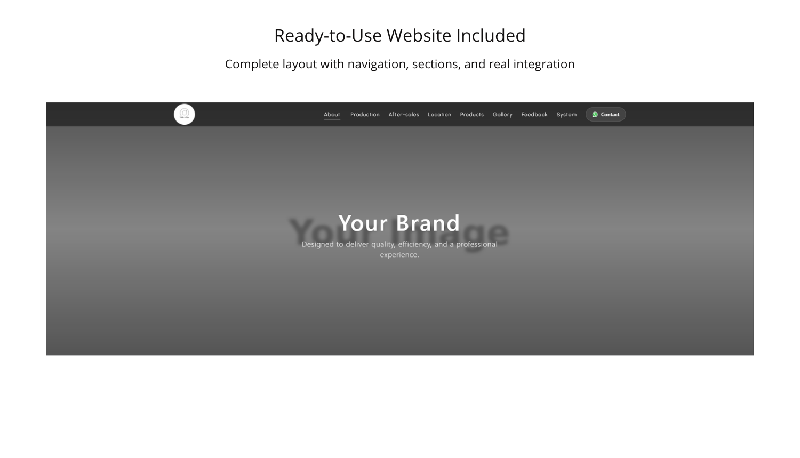
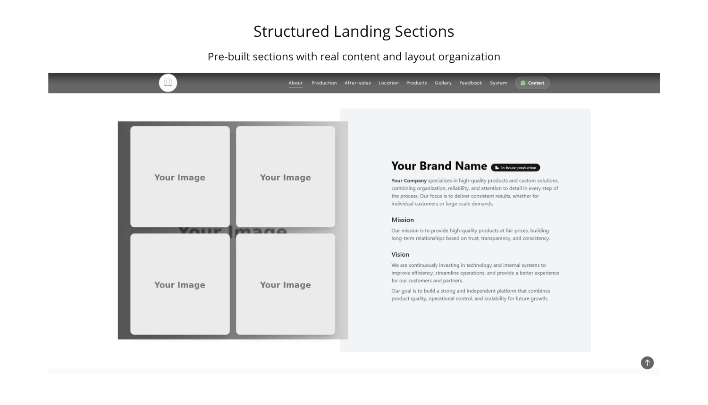

# feedback-system
# 🚀 Feedback System (Google Sheets)

Add real customer reviews to your website — without a backend.

## 📸 Preview

A production-ready dynamic feedback system designed for modern websites.

Collect, manage, and display feedback in real time using Google Sheets as your data source.

Easy to set up and integrate into your project.

---

## ✨ Features

* Real-time dynamic feedback system with customizable sections

* Google Apps Script integration (serverless backend)

* No database required (Google Sheets as storage)

* Image upload with Google Drive support

* Smart image handling with automatic fallback and retry system

* Modular and scalable architecture

* Built with Vite + Tailwind CSS

* Clean and maintainable codebase

---

## ⚙️ What you get

* Full source code (`/src`)

* Production-ready build (`/dist`)

* Complete documentation:

  * Installation guide
  * GAS setup
  * Endpoint configuration

* Ready-to-use system

---

## 🚀 Getting Started

1. Set up Google Apps Script
2. Add your endpoint
3. Run and customize

---

## 💡 Use Cases

* Portfolio websites
* Business websites
* Landing pages
* Client projects

---

## 🧠 Notes

* Designed for developers and builders
* Basic JavaScript knowledge recommended
* Highly customizable and extensible
* Includes bilingual comments (PT/EN)

---

## 🔥 Early Price

This product is currently priced at **$199**.

The price may increase in future updates.

---

If you have any questions, feel free to reach out!

[https://6625481749025.gumroad.com/l/bczeli ]

